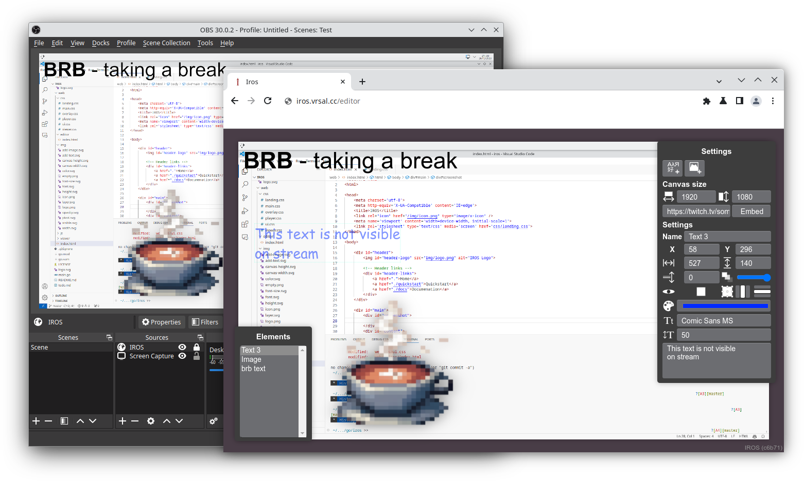

### Interactive Remote Overlay System

IROS allows for the control of an interactive overlay from a browser. The overlay can be added to
your stream via a browser source.

See [iros.vrsal.cc](https://iros.vrsal.cc) for more information.